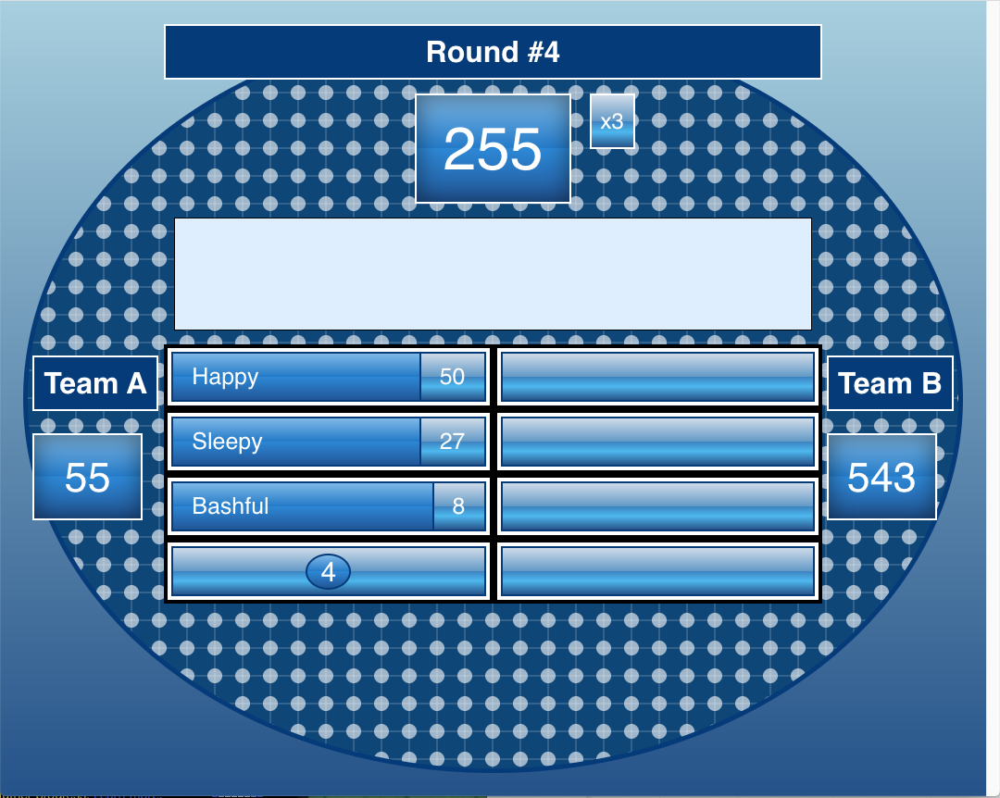

# Family Feud Display Prototype

A Family Feud themed **VueJS** dashboard that displays a question, scores, and hidden answers that can be individually revealed. The application uses a simple google spreadsheet as the data source, that someone can control and easily update values.

Originally created for an internal event at our office to play Family Feud Live with buzzers and a host. Also, it gave me a good excuse to practice core **VueJS** concepts in an actual project. The event had incredible feedback with dozens of participants and perhaps this can help someone else add something special to their own event.

[ ! ] WIP: This repo is a work in progress and I still need to add an example of how the data needs to be structured in the google spreadsheet for this to work seamlessly. Please feel free to open an issue if you need this prioritized for any upcoming event.




## Setup

#### Update Spreadsheet Info

1) Open and edit: ```.env.example```\
2) Replace 'xx' in ``` VUE_APP_SHEET_SESSION_1 = xx``` with your spreadsheet ID.\
3) Rename to:  ```.env```

[ ! ] FYI: this variable is used in ```src/pages/BoardPage.vue``` at LN 67

#### Creating Spreadsheet
...work in progress


## Usage

#### Run server
In your Terminal, run the following:
```
npm run serve
```

#### Updating Spreadsheet + Display
As of right now, this only displays the spreadsheet data, you have to refresh
in order to view any updates on the spreadsheet e.g revealing an answer.

But there is a **temporary** workaround that works to update without a full refresh. The following method is exposed to the window object to fetch data source again.
```
// open you browswer's dev console and run the following
window.refresh()
```


## Roadmap
As this was only a prototype that needed a quick turnaround time in order to make it for our event, it is very basic. I'm hoping this project can evolve to include additional features and make it easier for the general public to use.

- create separate page for Host to control the spreadsheet through easy toggle interface and easily reveal answers and other values.

- use websockets on display page so it can easily know when it should refresh.

- make it easier for the public to create the spreadsheet structure needed to run the game.


## Shoutouts

Would like to give a shoutout to https://codepen.io/MacEvelly, the 'look' was heavily inspired by one of his css creation.
